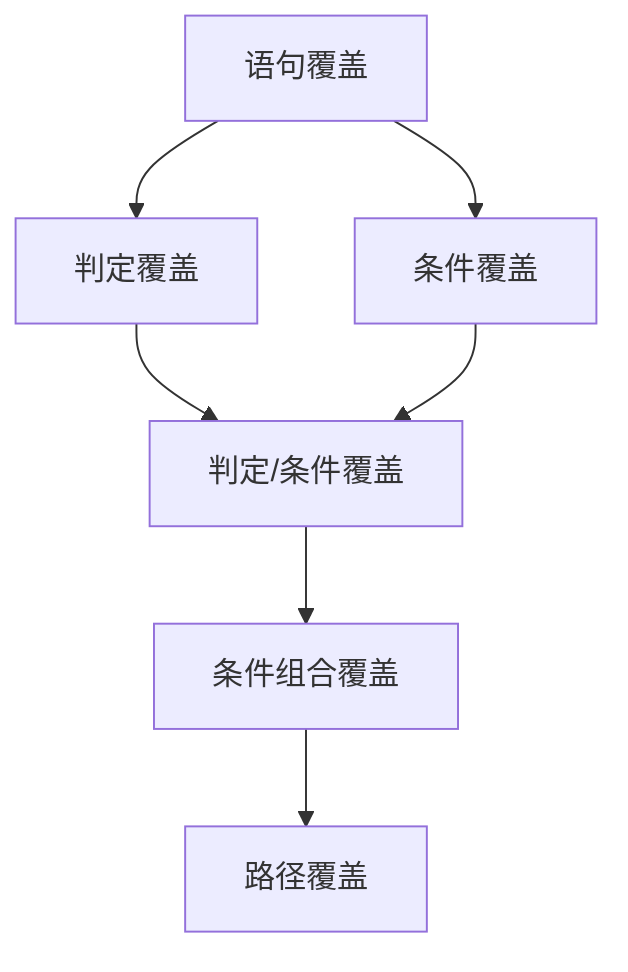

##  软件测试的概念

### 软件

软件=程序+文档

### 软件测试

软件测试（Software Testing），描述一种用来促进鉴定软件的正确性、完整性、安全性和质量的过程。换句话说，软件测试是一种实际输出与预期输出之间的审核或者比较过程。软件测试的经典定义是：在规定的条件下对程序进行操作，以发现程序错误，衡量软件质量，并对其是否能满足设计要求进行评估的过程。

### 缺陷

#### 什么是软件缺陷

+ 没有实现《需求规格说明书》中需要实现的功能
+ 实现了《需求规格说明书》中没有提到的功能
+ 实现了基本功能，但未实现一些虽未明确规定但应该实现的目标，如软件难以理解，不易使用，运行缓慢等

#### 产生原因

+ 软件产品说明书（需求）
+ 设计
+ 编写代码
+ 其它

### 测试用例

+ 定义：在测试执行之前设计的一套详细的测试方案，包括测试环境、测试步骤、测试数据和预期结果
+ 测试用例=输入+输出+测试环境
  + 输入：测试数据和操作步骤
  + 输出：期望结果
  + 测试环境：系统环境设置
 + 设计测试用例是创造性劳动，而执行测试用例是体力劳动，设计测试用例是软件测试的关键


## 黑盒测试

### 概念

+ 又叫功能测试，数据驱动测试或基于规格说明的测试。（实际上，黑盒测试包括功能测试和性能测试）

+ 测试过程

  ```mermaid
  graph LR
  A[需求说明] --> |产生| B[被测程序] -->|输出| C[测试结果]
  C[测试结果] -->|比较| A[需求说明]
  
  ```

+ 黑盒测试的难点在于如何构造有效的输入
  + 由于输入空间通常是无限的，穷举测试显然行不通。 
  + 寻找最小最重要的用例集合以精简测试复杂性。

### 除因果图外各种方法

#### 边界值分析

##### 基本原理

##### 基本思想

+ 在最小值、略高于最小值、正常值、略低于最大值和最大值处取输入变量值 
+ 表示方法min、min+、nom、max-和max 

##### 边界值分析获得测试用例的方法 

+ 使所有变量取正常值，只使一个变量取极值； 
+ 对于一个n变量函数，边界值分析会产生4n+1个测试用例。

##### 两个变量函数边界值分析测试用例 

+ X1取值：x1min,x1min+,x1nom,x1max-,x1max 
+ X2取值：x2min,x2min+ ,x2nom,x2max-,x2max 

##### 健壮性测试 


#### 基于判定表的测试

##### 判定表的组成

+ 条件桩（Condition Stub） 
  列出问题的所有条件 
+ 动作桩（Action Stub） 
  列出可能采取的操作 
+ 条件项（Condition Entity） 
  列出条件桩的取值 
+ 动作项（Action Entity） 
  列出条件项各种取值下应该采取的动作

##### 判定表的组成

##### 规则合并

+ 规则合并就是判定表的简化。 
+ 有两条或多条规则具有相同的动作，并且其条件项之间存在着极为相似的关系，就可以将规则合并。

#####  判定表建立步骤

+ 根据软件规格说明 
  ① 列出所有的条件桩和动作桩； 
  ② 确定规则的个数； 
       假如有n个条件，每个条件有两个取值（0,1）,则有2^n 种规则； 
  ③ 填入条件项； 
  ④ 填入动作项，得到初始决策表； 
  ⑤ 简化，合并相似规则（相同动作）。

##### 判定表的优点   
+ 能把复杂的问题按各种可能的情况一一列举出来 
+ 简明而易于理解 
+ 可避免遗漏 

##### 判定表的缺点 
+ 不能表达重复执行的动作，例如循环结构 

+ 判定表不能很好地伸缩 

+ 有n个条件的决策表有2^n 个规则

  

#### 场景法 


### 划分等价类

#### 等价类定义 

等价类是输入域的某个子集合，而所有的等价类的并集是整个输入域。在子集合中，各个输入数据对于揭露程序中的错误是等效的。

#### 有效等价类 

对于程序的规格说明来说，是合理的、有意义的输入数据所构成的集合；

#### 无效等价类 

对于程序的规格说明来说，是不合理的、没有意义的输入数据所构成的集合

#### 确定等价类的原则

+ 如果输入条件规定了取值范围或值的个数就可确定一个有效等价类和两个无效等价类
+ 如果输入条件是一个布尔量,则可以确立一个有效等价类和一个无效等价类。
+ 如果规定了输入数据的一组值, 且程序要对每一个输入值分别进行处理, 要对每一个规定的输入值确立一个有效等价类,而对于这组值之外的所有值确立一个无效等价类。
+ 如果规定了输入数据必须遵循的规则，可确定一个有效等价类和若干个无效等价类（从不同角度违反规则)。 （其他情况）
+ 如已划分的等价类各元素在程序中的处理方式不同，则应将此等价类进一步划分成更小的等价类

#### 用等价类设计测试用例

+ 分析输入输出，划分等价类，形成等价类表； 
+ 设计一新的测试用例，使其尽可能多地覆盖尚未覆盖的有效等价类，重复这一步骤，直到所有的有效等价类都被覆盖为止； 
+ 设计一新测试用例，使其只覆盖一个无效等价类，重复这一步骤直到所有无效等价类均被覆盖；

### 写测试用例


## Web测试

### 概念

> 如：搜索功能如何测试（角度）

#### 表单测试

+ 测试方法
  + 边界值测试
  + 等价类测试
  + 异常类测试
+ 文本框测试常见验证点
  + 输入正常的字母或数字，验证是否能正常工作。
  + 输入已存在的用户名或电子邮件名称，验证是否有唯一性校验。
  + 输入超长字符串，例如在“名称”框中输入超过允许边界个数的字符，假设最多255字符，尝试输入256个或以上字符，检查程序能否正确处理。
  + 输入默认值，空白，空格，检查程序能否正确处理。
  + 若只允许输入字母，尝试输入数字；反之；尝试输入字母，检查程序能否正确处理。
  + 利用复制，粘贴等操作强制输入程序不允许的输入数据，检查程序能否正确处理。
  + 输入特殊字符集，例如，NULL及\n等，检查程序能否正确处理。
  + 输入中文、英文、数字、特殊字符（特别注意单引号和反斜杠）及这四类的混合输入，检查程序能否正确处理。
  + 输入不符合格式的数据，检查程序是否正常校验，如：程序要求输入身份证号，
  + 输入abc123，程序应该给出错误提示。
  + 输入html语言的\<head>、\<html>、\<b>等，检查是否能原样正确显示。
  + 输入全角、半角的英文、数字、特殊字符等，检查是否报错。
+ 特殊输入域常见验证点
  + 密码框测试常见验证点
    + 密码输入域输入数据是否可见？密码的正确显示必须为“******”，不可见模式。
    + 密码是否可以全部是空格？密码设计必须不能全为空格。
    + 密码是否对大小写敏感？比如：密码“An@d123R”与“an@d123r”，一定不是同一个密码。
  + 日期填充域常见验证点 
    + 输入不符合格式的数据，检查程序是否正常校验，如：程序要求输入年月日格式为yy/mm/dd，实际输入yyyy/mm/dd，程序应该给出错误提示。
    + 无效日期处理，如：出生年月输入为2013/02/30，我们知道2月最多是29天，检查程序是否出错。
    + 出生日期填写为未来日期，比如3214/12/12，检查程序是否出错。
    + 将结束日期设置在开始日期之前，检查是否有正常校验。
  + 电话号码填充域常见验证点
    + 电话号码应该由一组数字组成，不能包含英文字母。
    + 如果有分机号，中间用破折号分隔。
  + 邮政编码填充域常见验证点
    + 国内的邮政编码都是数字。
    + 英国的邮编是字母与数字的组合，当我们测试国外邮编时需要先查一下该国的邮编格式。
  + 电子邮件填充域常见验证点
    + 电子邮件的格式为：xyz@xyz.xyz，输入错误的格式比如：aa@aa，123，aa#aa.aa，检查是否有错误提示。
    + 输入正确的电子邮件地址，需要能验证通过，并能收到相应的Email。
  + 购物数量填充域常见验证点
    + 在填写购物数量的地方，输入一个最大值，查看钱数累计的是否正确；
    + 在填写购物数量的地方，输入一个负数，检查是否有正确的处理；
    + 在填写购物数量的地方，输入一个数字0，检查是否有正确的处理；
    + 在填写购物数量的地方，输入一个字母a，检查是否有正确的处理；
    + 在填写购物数量的地方，输入一个特殊符号>，检查页面能否正确显示。
  + 必填字段常见验证点
    + 必填字段不输入任何内容，直接提交，检查是否有错误提示；
    + 必填字段只输入空格，然后提交，检查是否有错误提示；
    + 必填字段的提示是否统一。
  + 单选按钮常见验证点
    + 一组单选按钮不能同时选中，只能选中一个；
    + 逐一执行每个单选按钮的功能。分别选择了“男”、“女”后，保存到数据库的数据应该相应的分别为“男”、“女”；
    + 一组执行同一功能的单选按钮在初始状态时必须有一个被默认选中，不能同时为空。
  + 复选框常见验证点
    + 多个复选框可以被同时选中（全选）；
    + 多个复选框可以被部分选中（部分选）；
    + 多个复选框可以都不被选中（全不选）；
    + 逐一执行每个复选框的功能（选择保存后，查看保存结果是与所选择的一致）。
  + 大块文字区域常见验证点
    + 输入数据超出最大字符数，检查会出什么情况；
    + 输入数据正好为最大字符数，检查是否能正确保存；
    + 不输入任何数据，检查是否能正确保存；
    + 在Firefox或Chrome浏览器下，大块文字区域右下角一般都可以拖放，尝试用鼠标进行拖放，检查会不会导致界面很难看或滚动条消失。
  + 下拉列表框常见验证点
    + 条目内容正确，无重复条目，无遗失条目；
    + 逐一执行列表框中每个条目的功能。
  + 排序常见验证点
    + 选择正序排列后，再检查一下反序排序；
    + 对文字的排序，检查是否按从A到Z的顺序；
    + 对价格、数目等的排序，检查是否按数字大小顺序；
    + 如果有分页，检查是否先好排序再分页。
  + 分页测试常见验证点：
    + 当没有数据时，首页、上一页、下一页、尾页标签全部置灰，不支持点击；
    + 在首页时，“首页”“上一页”标签置灰；在尾页时，“下一页”“尾页”标签置灰；在中间页时，四个标签均可点击，且跳转正确；
    + 翻页后，列表中的数据是否仍按照指定的顺序进行了排序；
    + 各个分页标签是否在同一水平线上；
    + 各个页面的分页标签样式是否一致；
    + 分页的总页数及当前页数显示是否正确；
    + 是否能正确跳转到指定的页数；
    + 在分页处输入非数字的字符（英文、特殊字符等），输入0或超出总页数的数字，是否有友好提示信息；
    + 是否支持回车键的监听。
  + 搜索框填充域常见验证点
    + 搜索按钮功能是否实现；
    + 输入网站中存在的信息，能否正确搜索出结果；
    + 输入键盘中所有特殊字符，是否报错；特别关注：_？＇＂# \ / -- < >；特殊字符；
    + 搜索出的结果页面是否与其他页面风格一致；
    + 在输入域输入空格，点击搜索系统是否报错；
    + 本站内搜索输入域中不输入任何内容，是否搜索出的是全部信息或者给予提示信息；
    + 输入NULL/null、或很长的字符串，会出现什么结果；
    + 精确查询还是模糊查询，如果是模糊查询输入：中%国（中*国），查询结果是不是都包含中国两个字的信息；
    + 焦点放置搜索框中，搜索框默认内容是否自动被清空；
    + 搜索输入域是否实现回车键监听事件。
  + 用户登录常见验证点
    + 用户名和密码都符合要求并且是正确的，检查是否能登录成功；
    + 用户名和密码都不符合格式要求，检查是否能登录成功以及出错提示；
    + 用户名符合要求，密码不符合要求，检查是否能登录成功以及出错提示；
    + 密码符合要求，用户名不符合要求，检查是否能登录成功以及出错提示；
    + 用户名或密码为空，检查是否能登录成功以及出错提示；
    + 数据库中不存在的用户名，不存在的密码，检查是否能登录成功以及出错提示；
    + 数据库中存在的用户名，错误的密码，检查是否能登录成功以及出错提示；
    + 数据库中不存在的用户名，存在的密码，检查是否能登录成功以及出错提示；
    + 输入的用户名或密码前存在空格，检查是否能登录成功以及出错提示；
      按键盘上的回车键是否监听事件，能执行登录过程。

#### 界面测试

用户界面测试，英文是User interface testing，又称UI Testing，是指软件中的可见外观及其底层与用户交互的部分，包括菜单、对话框、窗口和其它控件。

+ 文字重叠问题
+ 字符显示不完整
+ 乱码
+ Tooltip对应不同
+ 菜单对应不一致
+ 鼠标变小手
+ 不同浏览器显示问题
+ 不同版本浏览器显示问题
+ 不同OS & Browser显示问题
+ 对齐问题
+ 图片显示问题
+ 各个页面的样式风格是否统一 
+ 各个页面的标题Title是否正确
+ 导航处是否按相应的栏目级别显示
+ 所有的图片是否都被正确装载，在不同的浏览器、分辨率下图片是否能正确显示（包括位置、大小）
+ 窗口缩小
+ ......

#### 功能测试

功能测试（Functional testing）。Web应用程序中的功能测试主要是对页面的链接、按钮等页面元素功能是否正常工作的测试。

+ 链接问题
  + 链接不工作
  + 空链接
  + 链接页面错误
+ 按钮问题
  + 按钮不工作
  + 点击按钮产生JSerror
+ 本身应该具有的功能
  + 该有的功能没有实现
  + 该有的功能错误对应到另一功能
+ 提示问题
  + 缺少提示
  + 提示信息错误
  + 提示导致UI问题

#### 安全测试

+ 编辑框

  ```html
  <script>alert(“XSS”)</script>
  ```

+ URL

  ```html
  URL+<script>alert(“XSS”)</script>
  ```

+ 修改URL

  修改URL导致显示其他内容

+ SQL注入

### 写缺陷报告


### selenium写代码

+ Elements can be accessed in many ways:

  + Element attribute: 

    + name

      ```java
      driver.findElement(By.name("password")).sendKeys(“aaaa");
      ```

    + id

      ```java
      driver.findElement(By.id("user")).sendKeys("wangtianci");
      ```

    + value

  + Xpath 

    ```java
    driver.findElement(By.xpath("//[@id=\"kw\"]")).sendKeys("selenium");
    ```

  + LinkText

    ```java
    driver.findElement(By.linkText("学术")).click();
    ```

+ User actions that can be emulated:

  + Click
  + Filling out text fields (sending keys)

```java
import java.util.List;

import org.openqa.selenium.By;
import org.openqa.selenium.WebDriver;
import org.openqa.selenium.chrome.ChromeDriver;
import org.openqa.selenium.support.ui.Select;
import org.openqa.selenium.WebElement;

public class App {
    private static WebDriver driver = new ChromeDriver();
    public static void main(String[] args) throws Exception {
        System.out.println("Hello, World!");
        System.setProperty("webdriver.chrome.driver","/usr/bin/chromedriver");
        //亚马逊
        driver.get("https://www.amazon.com/?currency=USD&language=en_US");

        //选择搜索类别--书籍
        selectItem("search-alias=stripbooks-intl-ship");
        //搜索“selenium design patterns"
        search("selenium design patterns");
        //选择结果第一项
        chooseResult();
        //加入购物车并查看购物车
        addToCart();
        
    }

    public static void sleep(int time) {
        try {
            Thread.sleep(time);
        } catch (InterruptedException e) {
            // TODO Auto-generated catch block
            e.printStackTrace();
        }
    }

    //选择搜索类别
    public static void selectItem(String value){
        sleep(2000);
        WebElement formElement = driver.findElement
        (By.id("searchDropdownBox"));
        sleep(1000);

        Select downList = new Select(formElement);
        downList.selectByValue(value);

        List<WebElement> list = downList.getAllSelectedOptions();
        for(WebElement option : list) {
            System.out.println(option.getText());
        }
        System.out.println(downList.getFirstSelectedOption().getText());

    }

    //搜索
    public static void search(String keywords) {
        sleep(1000);
        WebElement searchBox = driver.findElement(By.id("twotabsearchtextbox"));
        searchBox.sendKeys(keywords);
        WebElement searchButton = driver.findElement(By.id("nav-search-submit-button"));
        searchButton.click();
        System.out.println("Searching...");
    }

    //选择搜索结果的第一项
    public static void chooseResult() {
        sleep(3000);
        WebElement chosen = driver.findElement
            (By.cssSelector(".a-link-normal:first-child"));
        chosen.click();
    }

    //加入购物车
    public static void addToCart() {
        sleep(1500);
        WebElement tag = driver.findElement(By.id("mediaTab_heading_1"));
        tag.click();
        sleep(1500);
        WebElement toBuy = driver.findElement(By.id("a-autoid-2-announce"));
        toBuy.click();
        sleep(2000);
        WebElement addToCart = driver.findElement(By.name("submit.addToCart"));
        addToCart.click();
        sleep(2000);
        WebElement option_cart = driver.findElement(By.id("hlb-view-cart-announce"));
        option_cart.click();
    }
}
```


## 白盒测试

### 概念

#### 定义 

白盒测试又叫结构测试，逻辑驱动测试或基于程序本身的测试。 

#### 动态测试  

##### 逻辑覆盖

> 每一个标准的含义 

+ 语句覆盖 

  设计若干条测试用例，使程序中每条可执行语句至少执行一次。

+ 判定覆盖（分支覆盖） 

  设计测试用例，使程序中的每个逻辑判断的取真和取假的分支至少经历一次。

+ 条件覆盖 

  设计若干测试用例，使程序的每个判定中的每个条件的可能取值至少满足一次

+ 判定-条件覆盖 

  使判定中每个条件的可能取值至少满足一次，并且使每个判定分支至少执行一次。 

  判定-条件覆盖能同时满足判定、条件两种覆盖标准。

+ 条件组合覆盖 

  设计用例，使得每个判断表达式中条件的各种可能组合都至少出现一次；

+ 路径覆盖

  设计足够多的测试用例，覆盖程序中的每条可能路径。



##### 写覆盖

+ Draw the CFG for the code fragment.

+ Compute the cyclomatic complexity number C, for the CFG.

  + Cyclomatic complexity 
    + The number of ‘regions’ in the graph;  
    + The number of predicates + 1

+ Find at most C paths that cover the nodes and arcs in a CFG, also known as Basic Paths Set;

+ Design test cases to force execution along paths in the Basic Paths Set.

  

##### Junit写代码

+ The annotations in Junit
  + @Test public void method()
     this means the method is used to test the other methods.

  + @Before public void method()
     the method is always executed before every test method is executed. It is usually used to prepare some data, or give some initial values.

  + @After public void method()
     the method is always executed after every test method is executed. It is usually used to free up some storage space.

  + @BeforeClass public static void method()

    the method is only executed once before all test methods are executed. It is usually used to do what all methods depend on, like connecting database.

  + @AfterClass public static void method()
     contrary to @BeforeClass

  + @Ignore public void method()
     the method will be ignored.

  + @Test(expected=IllegalArgumentException.class)
    Check if the exception can be thrown
    ```java
    @Test(expected=ArithmeticException.class)
    public void testDiv() {
        Math demoMath=new Math();
        int expected;// expected result
        int actualvalue;// actual result
        expected=2;
        actualvalue=demoMath.div(1, 0);
        assertEquals(expected, actualvalue);
    }
    ```
    
  + @Test(timeout=100)
    If the execution time of the method is greater than 100ms, the test fails.
  
    ```java
    @Test(timeout=1)
    public void testDiv() {
        Math demoMath=new Math();
        int expected;//expected result
        int actualvalue;//actual result
        expected=2;
        actualvalue=demoMath.div(2, 1);
        assertEquals(expected, actualvalue);
    }
    ```
  
+ Assertion methods

  + assertEquals
  + assertArrayEquals
  + assertFalse
  + assertTrue
  + assertNull
  + assertNotNull
  + assertSame
  + assertNotSame
  + …….


## 性能测试

### 概念

性能测试是通过自动化的测试工具模拟多种正常、峰值以及异常负载条件来对系统的各项性能指标进行测试。


